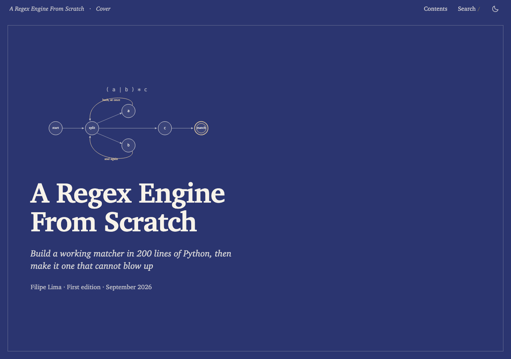
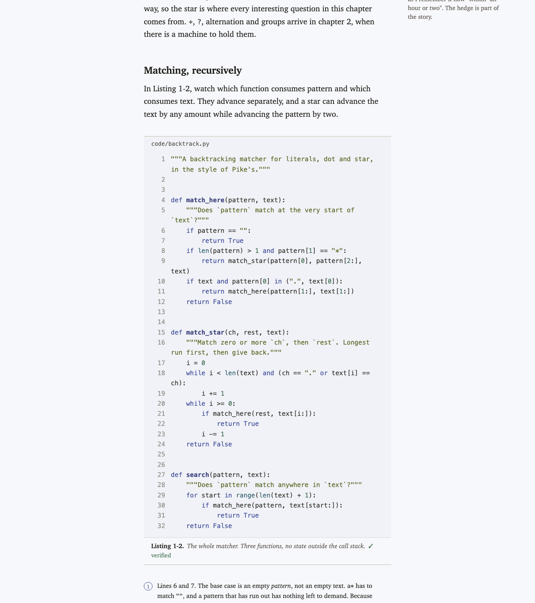

# techbook

A [Claude Code](https://claude.com/claude-code) skill that writes technical books —
and refuses to publish one whose code examples have not actually run.

Any model can produce a book full of plausible-looking code. This one extracts every
fenced block, executes it in a sandbox, diffs the real output against what the book
claims, and blocks the build if they disagree.

```
Book verification · 2026-09-05
──────────────────────────────────────────────────────────────
Blocks    31 total   (23 from cache)
  OK             23
  literal         8

All code verified.
```

<p align="center">
  
</p>

## Why

I went looking for an existing technical-book skill and found that the space is almost
entirely 1–20★ hobby repos, none of which publish a finished book as evidence their
pipeline works. The parts that *are* well-studied — long-form generation, deep
research, verified documentation — mostly point away from the obvious design. So this
implements what the evidence supports, and gates the output on something checkable.

## Install

```sh
git clone https://github.com/fpl0/techbook ~/Code/techbook
ln -sfn ~/Code/techbook/skill ~/.claude/skills/techbook
```

The symlink means edits to the clone take effect immediately. Start a new Claude
Code session for the skill to register.

**Requires:** Python 3.11+ (`verify.py` reads dependency manifests with `tomllib`;
on 3.10 it says so and stops rather than silently pinning nothing), macOS for the
`sandbox-exec` sandbox, plus a toolchain for whatever language your book's examples
are written in. Everything else is standard library — no `pip install`, no build step.

## Use

Ask for a book. The skill interviews you before writing anything, because the audience
and scope decisions are yours and everything downstream inherits them.

```
> write me a short book about how B-trees work, with runnable Rust
```

It then runs a gated pipeline: scope interview → parallel research with citation
liveness checks → a detailed per-chapter outline → sequential chapter drafting →
the code gate → staged editing → render. You approve the brief and the outline before
any prose is written. Runs are resumable from `state.json`:

```
> continue the book in ./btrees
```

Books default to `standard` depth (6–8 chapters, ~25k words). Say "short" or
"thorough" for `brief` (~8k) or `comprehensive` (~55k).

## What you get

```
my-book/
├── src/ch01-*.md        chapter sources, the durable artifact
├── src/front-matter.md  who it is for, who it is not for, how to read it
├── src/cover.svg        cover art, drawn with the skill's diagram kit
├── src/SUMMARY.md       mdBook-shaped, so adopting a toolchain later is one command
├── code/                every listing as a real file, importable by later listings
├── verify/python/       a real project with a real manifest
└── build/
    ├── index.html       cover, contents, front matter
    ├── chNN-*.html      one page per chapter
    ├── glossary.html    built from every chapter's "Terms introduced" line
    ├── book.html        cover, chapters and glossary in one self-contained file
    └── assets/          book.css, book.js, search.js
```

Code is syntax-highlighted at render time by `highlight.py`, so the colour is in
the HTML: it survives JavaScript being off, printing, and reading from a folder.
`book.html` inlines its CSS, JS and search index — zero external requests, so it works
offline and prints to a usable PDF. No framework, no web fonts, no CDN, and the book
stays readable with JavaScript disabled. Search works from `file://` because the
index ships as a script, not something to fetch.

Each book has its own look. `book.yaml` names one of eight palettes and one of five
system serif faces, chosen for the topic during the scope interview, and `render.py`
checks every colour pairing for WCAG AA contrast before it will build. Two books from
this skill share a typographic system, not a jacket.

<p align="center">
  
</p>

## The scripts

The skill drives these, but they work standalone on any book directory.

| Command | Does |
|---|---|
| `verify.py <book>` | lint the block contract, execute, diff, report |
| `verify.py <book> --promote` | accept output corrections |
| `verify.py <book> --strict` | publish gate: unverified blocks fail too |
| `verify.py <book> --only chNN` | restrict to matching chapters |
| `verify.py <book> --sync-code` | write each `file=` listing out to the path it names |
| `prose.py <book>` | ban-list, craft checks, em-dash density, sentence rhythm |
| `continuity.py <book>` | terms used before introduction, cross-chapter numbers, dangling refs |
| `render.py <book>` | Markdown → cover, chapter pages, glossary, single file; highlights code |
| `highlight.py <file> <lang>` | the render-time highlighter, usable on its own |
| `urlcheck.py <book>` | citation liveness, Wayback-backed |

### The block contract

Every fenced block declares a mode, and **an undeclared code block is a hard lint
error** — never a silent skip:

| Mode | Passes when |
|---|---|
| `run` | exits 0 **and** real output matches the ` ```output ` block below it |
| `check` | compiles or parses |
| `expect-error` | it fails, with the named message in stderr |
| `norun` | never — reported as unverified, with the reason you gave |
| `literal` | never executed; requires `why="…"` so it can't hide unchecked code |

Blocks sharing an `env=` run as one session, in document order, because a book's
listings are a narrative rather than independent units.

### Two things it does that most doc-testing setups don't

**Nothing is edited in place.** When real output differs from the book, `verify.py`
writes `chNN.md.corrected` beside the chapter and prints a diff. `--promote` is a
separate, deliberate step. You decide what your book says.

**Imports are resolved before anything executes.** Every import must already be pinned
in `verify/python/pyproject.toml` or `verify/node/package.json`. Roughly a fifth of
package names that language models suggest do not exist, the fabrications recur across
runs, and attackers register the popular ones — so installing to find out *is* the
attack. Execution is offline by default; a block that needs the network must say `net`.

## Does it work?

`demo/regex-from-scratch/` is a four-chapter book generated end to end through the
skill on 2026-09-05: three research subagents wrote cited notes, the outline was
built from those notes, four chapter-writer subagents ran in sequence with each
predecessor's summary, and every gate ran before render. Open
`demo/regex-from-scratch/build/index.html`.

```
A Regex Engine From Scratch
──────────────────────────────────────────────
Chapters    4            Prose words   15,069
Listings   31  verified  23 · illustrative 8 (exercise stubs)
Citations  83  live 77 · archived 3 · blocked 3 (doi/ACM 403, one bad cert)
Prose      em dash/1k 0.0 · sentence stdev 11.4 · ban-list 0 · craft 0
Continuity clean
```

Three things the pipeline caught that a careful read would not have:

| Caught by | Finding |
|---|---|
| exhaustive differential test (`code/difftest.py`) | The first parser accepted `a+?`, which Python reads as a lazy quantifier. 171 mismatches in 11,970 cases; the parser now refuses stacked quantifiers the way `re` refuses `a**`. Chapter 4 tells the story. |
| research notes with hedges preserved | Both famous regex outages were polynomial, not exponential; Cloudflare's post never says "exponential". The chapter says so, with the step counts. |
| `verify.py` output diffing | Every timing table and every traceback in the book is what the code printed on the author's machine, paths trimmed. |

The presentation was reviewed by a design-critic subagent (`.critique/design-review.md`)
and checked in a real browser at desktop and phone widths, light and dark.

Reproduce the gates:

```sh
python3 skill/scripts/verify.py demo/regex-from-scratch --strict
python3 skill/scripts/prose.py demo/regex-from-scratch
python3 skill/scripts/continuity.py demo/regex-from-scratch
python3 skill/scripts/urlcheck.py demo/regex-from-scratch
python3 skill/scripts/render.py demo/regex-from-scratch
open demo/regex-from-scratch/build/index.html
```

## Limitations

- **Code verification covers about a fifth of a book by word count.** The rest rests on `prose.py`, `continuity.py`, the rubric in `references/rubric.md`, and citation discipline — all weaker than a process exit code. "Every example ran" is the claim; "the book is correct" is not.
- **Hand-written benchmarks pass the gate.** Durations normalise to `<DUR>` so diffs stay stable across runs, which means an invented timing is indistinguishable from a measured one. The gate cannot catch this; `references/block-tags.md` tells authors to paste measured output, and that's the only protection.
- **No semantic cross-chapter repetition detection**, and no automatic through-line measurement. Neither has a good solution in the literature. The structural editing pass is partial; the final read is human.
- **macOS only** for sandboxing. `sandbox-exec` has no Linux equivalent wired up here; without it, blocks still execute but unsandboxed.
- **Verification covers exit status and output text.** Not memory, not concurrency, not anything a test suite would catch that stdout doesn't show.
- A `comprehensive` run is many subagents and hours of wall time.

## Design notes

Three choices where the research points away from the obvious answer:

- **Research runs in parallel; writing runs in series.** LangChain shipped parallel section-writers and pivoted away — the sections did not know about each other.
- **No book toolchain.** Every technical book people praise for its HTML uses a custom pipeline; mdBook, Quarto and Docusaurus all impose a recognisable docs-site look and all fail the fresh-machine test. `SUMMARY.md` is still emitted, so adopting mdBook later costs one command.
- **State on disk, not in context.** Chapter 1's details are diluted by the time chapter 8 is written, even when technically still in the window.

## Layout

```
skill/            SKILL.md, references (7 files), assets (book.css, book.js), scripts (6)
skill/evals/      4 evals, 24 assertions
fixtures/         good / bad / rich — regression fixtures for the scripts
demo/             a real book built with the skill
.critique/        the design-critic review the presentation was built against
docs/             screenshots for this README
```

`fixtures/bad` deliberately contains one of every contract violation; running
`verify.py` against it should exit 2 with eight lint errors.

## Contributing

Issues and pull requests welcome. Before opening a PR, run the regression pass:

```sh
python3 skill/scripts/verify.py fixtures/bad          # expect exit 2, eight lint errors
python3 skill/scripts/verify.py fixtures/good --no-cache
python3 skill/scripts/verify.py fixtures/rich --no-cache && python3 skill/scripts/render.py fixtures/rich
python3 skill/scripts/verify.py demo/regex-from-scratch --strict
python3 skill/scripts/render.py demo/regex-from-scratch
```

Changes to `references/` change what chapter writers are told, so they change output.
Say what you tested against.

## License

MIT — see [LICENSE](LICENSE).
